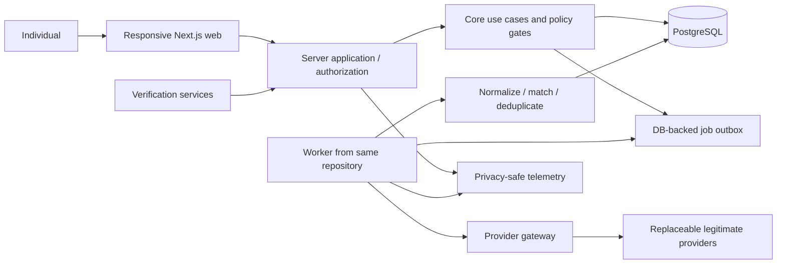
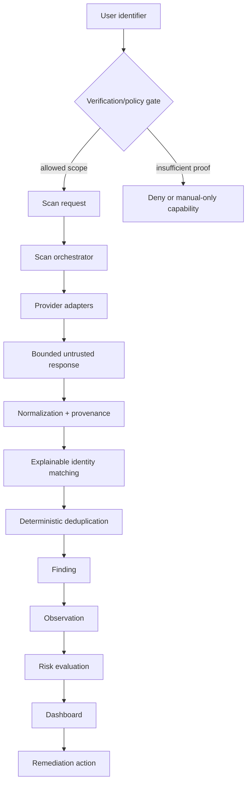
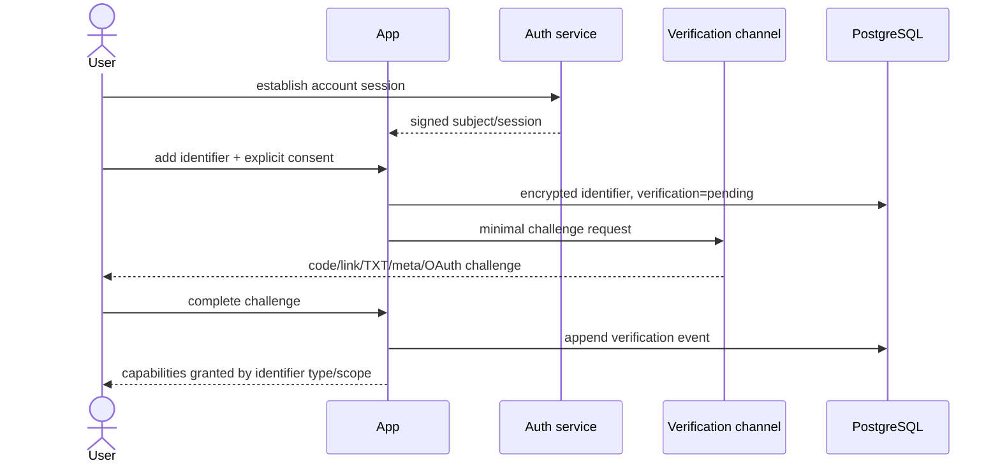

# System Architecture

**Status:** Proposed  
**Architecture style:** modular monolith with separately runnable worker when needed

## Recommendation

Use one TypeScript repository and one deployable Next.js application initially, backed by PostgreSQL. Keep domain modules explicit and framework-independent. When real asynchronous scans arrive, run a worker process from the same repository using a PostgreSQL-backed durable job table. Provider calls occur only server-side through adapters. Split deployments or packages only at demonstrated boundaries.

This is deliberately not an instruction to implement Phase 1.

## Architecture comparison

| Concern              | A: full-stack Next.js       | B: Next.js + dedicated API     | C: event-driven/serverless          |
| -------------------- | --------------------------- | ------------------------------ | ----------------------------------- |
| Developer complexity | lowest; one language/deploy | medium; two services/contracts | highest; distributed workflows      |
| Operations           | simple until long jobs      | explicit API/worker ops        | many managed components             |
| Local development    | easiest                     | workable via containers        | emulators and cloud gaps            |
| Scaling              | adequate for MVP            | services scale independently   | strong burst scaling                |
| Scheduled work       | needs worker/host support   | natural worker boundary        | native schedules but runtime limits |
| Retries/rate limits  | app-owned                   | app-owned and isolated         | managed options, fragmented state   |
| Observability        | coherent traces/logs        | cross-service tracing needed   | distributed tracing essential       |
| Security             | smaller surface             | more service auth/CORS         | more IAM/resources/misconfiguration |
| Cost at low usage    | low                         | moderate                       | low idle, potentially surprising    |
| Lock-in              | low/moderate                | low/moderate                   | often high                          |

Choose A with a worker-ready boundary. Move toward B if independent worker scaling, runtime isolation, team ownership, or a non-TypeScript capability becomes material. Choose C only when measured burst patterns and managed-queue benefits exceed distributed-system costs.

## Default technology choices

| Layer       | Recommendation                                     | Alternatives and rationale                                                      |
| ----------- | -------------------------------------------------- | ------------------------------------------------------------------------------- |
| Web/server  | Next.js + React + TypeScript                       | mature ecosystem and one stack; separate FastAPI/Node API is premature          |
| Database    | PostgreSQL                                         | relational integrity and temporal queries beat document flexibility here        |
| Data access | Drizzle or Prisma, decide in Phase 1 spike         | Drizzle favors SQL transparency; Prisma favors ergonomics; no ORM installed now |
| Jobs        | PostgreSQL job table/leases                        | avoids Redis initially; later BullMQ/managed queue                              |
| Auth        | managed standards-based service                    | reduces credential-handling burden; assess portability, privacy, deletion, cost |
| Hosting     | portable Node-compatible host + managed PostgreSQL | choose after worker/runtime requirements; avoid provider-specific APIs in core  |
| Telemetry   | OpenTelemetry-compatible traces/metrics            | vendor-neutral; redact before export                                            |
| Tests       | Vitest, Playwright, provider contract fixtures     | fast TypeScript unit tests and browser-level validation                         |
| Quality     | ESLint + Prettier + strict TypeScript              | widespread and maintainable                                                     |

Cloudflare/Vercel/Render/Fly/AWS are deployment candidates, not selected in Phase 0. Hosting must support regional/legal needs, background execution, egress controls, secrets/KMS, backups, and complete deletion.

## High-level design



Trust boundaries: browser/server; app/database; app/worker; system/external provider; telemetry exporter. Raw external content never reaches rendering or an LLM directly.

## Data flow



## Authentication and identifier verification



Authentication proves control of the app account; verification separately proves control of an identifier or asset.

## Provider adapter boundary

Adapters are anti-corruption layers. They accept a minimal scan context and provider-specific request, return bounded raw records to a normalizer, and emit normalized candidate findings plus provenance. Core code knows categories and evidence, never provider response schemas.

Conceptual operations:

```text
supports(input, capability)
validate(input, authorization)
estimateCost(plan)
scan(context, cursor)
normalize(rawRecord, parserVersion)
healthCheck()
```

Required behaviors: stable provider ID; capability declaration; input minimization; explicit terms/retention metadata; deadlines; cancellation; pagination bounds; rate-limit classification; cost estimate; idempotency key; response-size cap; parser version; health state; kill switch. An adapter cannot write findings or send notifications directly.

Provider categories: Search, Social, Broker, Breach, Domain. A registry selects enabled adapters by capability, jurisdiction, verification level, user consent, budget, provider health, and feature flag.

## Job model

Logical work types are `ScanJob`, `ProviderJob`, `NormalizationJob`, `DeduplicationJob`, `RiskEvaluationJob`, and `NotificationJob`; these need not be six separate queue technologies. MVP uses one durable table with type/payload reference, state, attempt, `available_at`, lease owner/expiry, idempotency key, cancellation request, cost reservation, and sanitized failure code.

Rules:

- create scan and jobs transactionally via an outbox pattern;
- claim with leases and recover expired leases;
- at-least-once delivery, idempotent handlers, unique idempotency keys;
- exponential backoff with jitter, capped attempts, provider `Retry-After` honored;
- no retry for authorization, validation, budget, or permanent ToS failures;
- cancellation checked between bounded steps; provider calls may not be retractable;
- one provider failure yields `PARTIAL` if other useful results exist;
- reserve estimated spend before dispatch and reconcile actual usage;
- global/provider/user concurrency and quota controls;
- operator kill switch per provider/capability.

Later, move provider jobs to BullMQ/Redis or a managed queue if queue contention, throughput, delayed scheduling, or isolation is measured. PostgreSQL remains authoritative for scan/run state.

## Cost and rate-control architecture

Conceptual entities: `UserScanBudget(period, hard_limit, spent, reserved)`, `ProviderCostModel(unit, estimated_unit_cost, version)`, `UsageLedger(estimated, actual, currency, provider_run)`, and `QueryCache(scope_hash, provider, policy_version, expires_at)`.

Enforce hard daily/monthly provider caps, per-user frequency, pagination/result limits, cost reservation, cache reuse only where provider terms permit, no automatic fallback fan-out, adaptive rescan intervals, high-risk-first priority, anomaly alerts, and a global spend circuit breaker. “Unlimited” configuration is forbidden. Budgets fail closed.

## Isolation for external content

Provider egress uses an allowlist and fixed endpoints. Any later direct URL fetcher must run in an isolated worker with DNS/IP validation before and after redirects, private/link-local/metadata ranges blocked, scheme/port allowlists, response/time/decompression limits, no browser credentials, JavaScript disabled by default, content-type validation, sanitization, and malware-safe storage. Render links as untrusted; use redirect warnings and `rel=noopener noreferrer`.

Page text is data, never instructions. If an optional LLM is ever added, send minimized/redacted excerpts only after an explicit privacy review; isolate prompts, disallow tool authority, validate structured output, and require user confirmation. LLM output cannot determine identity, severity, or remediation success alone.

## Environments and domains

Use local, preview, and production with separate databases, keys, auth clients, provider credentials, budgets, telemetry, and deletion queues. Preview uses synthetic/mocked provider data by default. Never copy production PII to preview.

Begin with one origin. Later: `example.com` marketing and `app.example.com` application. Add `api.example.com` only for independently deployed/public API needs, `status.` when a real status service exists, and `docs.` when public documentation warrants it. Subdomains enlarge cookie/CORS/CSP configuration and are not free organization.

## Performance targets

- cached/database dashboard view p75 under 2 seconds on ordinary mobile broadband;
- database-backed API p95 under 500 ms excluding deliberate network providers;
- scans always asynchronous and acknowledge within 1 second;
- per-provider timeout and payload limit isolate failures;
- no target for full scan duration until providers are selected and measured.

## Feature flags

Provider/capability flags are recommended as operational kill switches, staged rollout controls, and jurisdiction gates. Downsides are stale branches and configuration ambiguity. Mitigate with typed registry metadata, owner/expiry, tests for both states, audit changes, and removal after stable rollout. Flags are not authorization: every request still enforces verification and policy.

## Repository strategy

A single repository is warranted. Day-one `apps/` and `packages/` folders add build orchestration and version-boundary overhead without independent releases. Current `src/` modules advertise seams. Reconsider a monorepo when web and worker require materially different dependency/deploy lifecycles or a second client consumes shared versioned packages.
