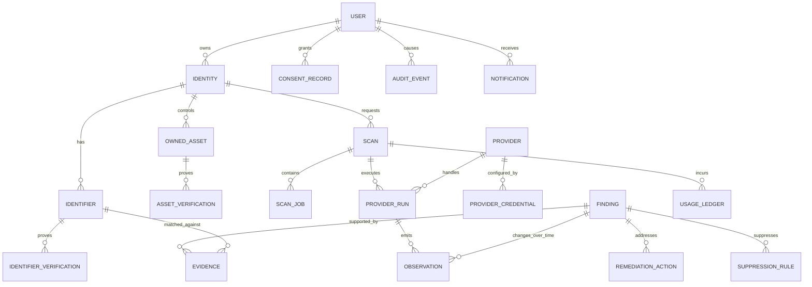

# Conceptual Data Model

**Status:** Proposed; no executable schema or migration exists.

## Modeling principles

- `User` is an account principal, not a container for raw identifiers.
- `Identity` is the self being monitored; MVP permits one per user.
- `Identifier` holds a typed, encrypted value and a keyed lookup token.
- Verification and consent are append-only evidence, not booleans without history.
- `Finding` is the stable claim; `Observation` records time-varying provider evidence.
- `Evidence` and provenance explain why a claim is attributed to an identity.
- Personal Footprint and Owned Digital Assets use separate scopes.
- Provider payloads are quarantined, bounded, short-lived, and optional—not the system of record.

## Entity relationships



## Core entities

### User and Identity

`User`: opaque ID, auth subject, state, locale/timezone, created/deletion-requested/deleted times. Do not duplicate auth credentials.  
`Identity`: user ID, label, monitoring scope (`SELF` initially), lifecycle state. Future family/delegated identities require a new authority model.

### Identifier

Types: `EMAIL`, `USERNAME`, `PHONE`, `FULL_NAME`, `ALIAS`, `DOMAIN`, `WEBSITE`, `SOCIAL_PROFILE`, `ORGANIZATION`, `LOCATION`.

Conceptual fields:

```text
id, identity_id, type
encrypted_value, encryption_key_version
lookup_token (keyed HMAC; never an unsalted hash for guessable values)
normalization_version
verification_status: UNVERIFIED | PENDING | VERIFIED | EXPIRED | REVOKED
sensitivity
created_at, last_verified_at, deleted_at
```

Normalization happens in trusted application memory; normalized cleartext is not persisted by default. Display uses decrypt-on-authorized-read or a safe masked value. Usernames may later be stored plaintext only after an explicit field-by-field privacy decision; uniform encryption is the safer default.

`IdentifierVerification`: method, challenge ID/token hash, status, issued/expires/completed time, verifier/provider, scope granted, and evidence metadata without reusable OTPs.

### OwnedAsset

Represents only a domain or website the user is authorized to monitor. Fields include encrypted canonical asset value, type, state, verification level, and last verified time. `AssetVerification` captures DNS TXT, web file/meta, registrar/OAuth, or manual evidence. Verification expires and must be rechecked for active scanning.

### Scan, ScanJob, ProviderRun

`Scan`: identity, scope, trigger (`USER` initially), requested capability snapshot, state (`QUEUED`, `RUNNING`, `PARTIAL`, `COMPLETED`, `FAILED`, `CANCELLED`), coverage summary, timestamps, cancellation request.  
`ScanJob`: type, state, payload reference, idempotency key, attempt/max attempts, availability, lease, sanitized error, timestamps.  
`ProviderRun`: provider/config version, parser version, scan, capability, health outcome, request token hash (not raw query), started/finished, result counts, cost estimate/actual, response retention deadline, error class.

### Finding

```text
id, identity_id
type, category, scope (PERSONAL_FOOTPRINT | OWNED_ASSET)
source_provider_id
title, description
canonical_url, normalized_host, provider_external_id
matched_identifier_id (nullable; never copy raw value)
confidence, confidence_method_version, confidence_explanation
sensitivity, severity, risk_model_version
first_seen, last_seen, last_checked
presence_state: PRESENT | MISSING | UNKNOWN
status
fingerprint, fingerprint_version
remediation_summary
created_at, updated_at
```

Finding types: `WEB_MENTION`, `SOCIAL_PROFILE`, `EMAIL_EXPOSURE`, `PHONE_EXPOSURE`, `ADDRESS_EXPOSURE`, `DATA_BROKER_PROFILE`, `BREACH`, `DOMAIN_EXPOSURE`, `PUBLIC_DOCUMENT`, `USERNAME_MATCH`, `OTHER`.

Confidence: `VERY_LOW`, `LOW`, `MEDIUM`, `HIGH`, `VERIFIED`.  
Sensitivity: `PUBLIC`, `LOW`, `MODERATE`, `SENSITIVE`, `HIGHLY_SENSITIVE`.  
Status: `NEW`, `REVIEWED`, `CONFIRMED`, `FALSE_POSITIVE`, `IGNORED`, `REMEDIATION_IN_PROGRESS`, `RESOLVED`, `REAPPEARED`.

Severity is risk/action priority, not sensitivity. It should consider confidence, sensitivity, source reach, persistence, breach categories, and remediation difficulty under a versioned model.

### Observation

An immutable event that a provider checked a resource at a time. Fields: finding, provider run, `observed_at`, presence (`PRESENT`, `MISSING`, `INDETERMINATE`), source timestamp, HTTP/retrieval metadata safe to retain, evidence summary, content fingerprint, confidence at observation, and optional prior observation link.

A finding becomes missing only after provider-specific confirmation rules; a transient timeout creates `INDETERMINATE`, never `MISSING`. `RESOLVED` requires user action or sufficient consecutive absence observations. A later `PRESENT` observation changes it to `REAPPEARED`.

### Evidence and provenance

`Evidence`: finding, identifier reference, evidence kind, redacted summary, value token/hash when safe, weight/rationale, source URL, provider external ID, query type, query time, retrieval time, parser version, confidence method/version, retention class. Evidence blobs, if unavoidable, use encrypted quarantined object storage with an expiry.

The UI explanation is produced from structured evidence, for example: “Exact verified email match (strong), same linked domain (medium), location not evaluated.” It also shows counter-signals and which checks were unavailable. A model version makes historical decisions reproducible.

### Remediation, Suppression, Notification

`RemediationAction`: finding, action type, instructions version/source, state, external URL, submitted/user-claimed/verified times, next check, outcome evidence. `SUCCESS` must say whether verified externally or user reported.  
`SuppressionRule`: identity, provider, external resource or normalized key, reason, scope, created/revoked/expiry times. It is checked before surfacing but does not delete historical audit evidence.  
`Notification`: type, finding reference, channel, generic preview, state, created/read/sent times. Sensitive content is fetched after authentication, not copied into outbound payloads.

### Provider, credentials, audit, consent, cost

`Provider`: stable ID, category, version, health, terms review date, allowed jurisdictions/capabilities, retention constraints, kill-switch state.  
`ProviderCredential`: provider and secret-manager reference; never the secret value in application tables.  
`AuditEvent`: actor ID/type, action, target opaque ID, result, request/correlation ID, time, coarse security context; never raw PII.  
`ConsentRecord`: identity, purpose, data categories, provider/category scope, policy version, granted/withdrawn time. Withdrawal stops future processing and triggers deletion rules.  
`UsageLedger`: provider run, cost model version, estimated/actual units and monetary amount, budget period.

## Finding deduplication

| Strategy                  | Strength                     | Weakness                                                |
| ------------------------- | ---------------------------- | ------------------------------------------------------- |
| canonical/normalized URL  | simple and explainable       | URLs mutate; tracking/canonical ambiguity               |
| content hash              | detects exact content        | tiny edits split; requires retaining/processing content |
| source + external ID      | strongest when stable        | not always available; provider can recycle IDs          |
| identifier + hostname     | groups exposures             | can merge distinct pages                                |
| semantic similarity       | handles near-duplicates      | cost, opaque errors, PII/AI risk                        |
| deterministic fingerprint | stable, indexed, versionable | normalization mistakes affect identity                  |

Recommended default:

```text
SHA-256(
  fingerprint_version || finding_type || provider_scope ||
  normalized_registrable_domain || identifier_lookup_token ||
  normalized_resource_id
)
```

Prefer stable provider external ID for `normalized_resource_id`; otherwise normalized canonical path/resource key. Exclude titles, snippets, timestamps, tracking parameters, and mutable content. Store version and collision evidence. Deduplication merges candidate observations into a finding; it never discards provenance. Cross-provider equivalence is a separate link/group, not an automatic merge.

## Non-executable schema policy

Phase 1 implements only the foundation subset in Drizzle/PostgreSQL: `User`, one `Identity`, encrypted `Identifier`, `IdentifierVerification`, `ConsentRecord`, `AuditEvent`, and `DeletionReceipt`. The remaining conceptual entities in this document have no executable persistence. No seed or real personal data is included. Multi-tenant isolation and deletion mechanics require further threat testing before any shared preview handles personal data.
