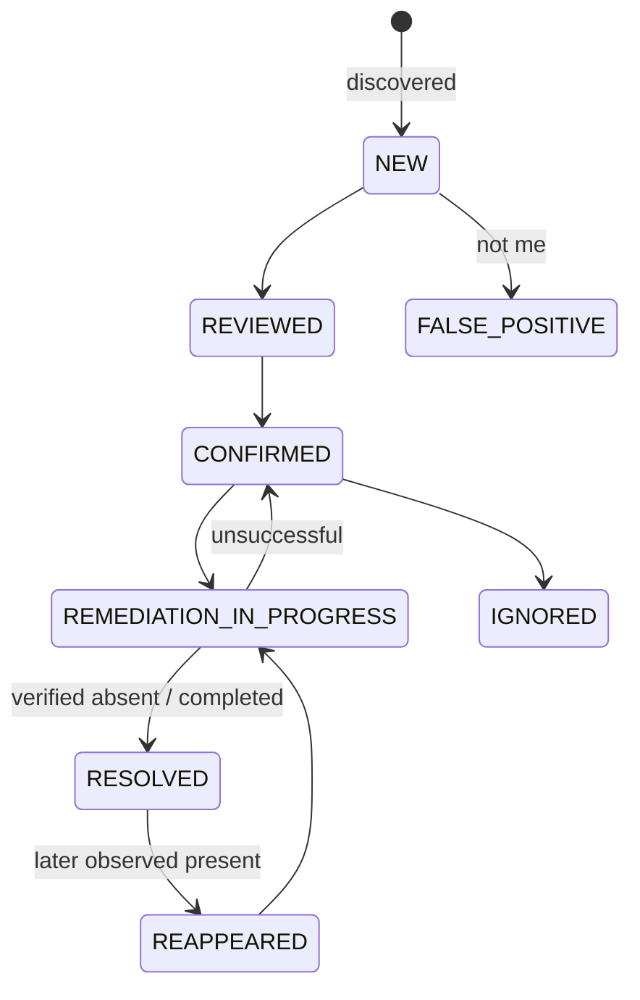
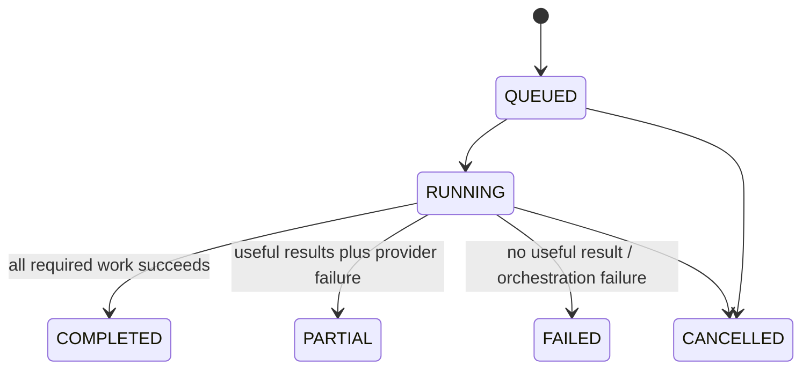

# Product Definition

**Status:** Proposed, Phase 0  
**Product:** Digital Footprint Tracker  
**Principle:** evidence and action for self-monitoring, never generalized people surveillance

## Problem and promise

People have fragmented, stale, and sometimes sensitive information across search results, profiles, breach notices, brokers, public documents, and assets they own. The product should answer:

> What information about me is publicly visible online, where is it visible, how sensitive is it, why do we think it is mine, and what can I do about it?

It must organize evidence into explainable findings and history. Coverage is never guaranteed; “no finding” means “not observed through enabled sources,” not “not exposed.”

## Target user and jobs

Initial user: one adult monitoring their own identifiers and owned digital assets. Core jobs are to inventory verified identifiers, run a bounded scan, review ambiguous matches, prioritize high-sensitivity exposure, follow honest remediation guidance, see changes, and delete all account data.

Personal Footprint and Owned Digital Assets are separate product areas. The latter requires verified control and may examine DNS, TLS, HTTP, and mail-security configuration; it must never become general infrastructure reconnaissance.

## Product principles

1. Verification unlocks capability; unverifiable names unlock little.
2. Show source, timestamp, confidence rationale, and stored-data policy for every finding.
3. Prefer user confirmation over probabilistic identity claims.
4. State partial coverage and provider failures plainly.
5. Never present a submitted removal request as successful removal.
6. Minimize and expire raw data.
7. Prefer category risk and actions over a fear-inducing universal score.

## Conceptual information architecture

| Route            | Purpose                     | Primary content                                                |
| ---------------- | --------------------------- | -------------------------------------------------------------- |
| `/`              | Trust-oriented introduction | scope, safety boundary, storage/deletion promise               |
| `/dashboard`     | Privacy overview            | active/high-priority counts, new/resolved, partial-scan notice |
| `/identities`    | Monitored self              | identities, identifiers, verification, consent                 |
| `/findings`      | Evidence inbox              | filters, confidence, sensitivity, state, “not me”              |
| `/findings/[id]` | Explainable finding         | provenance, observations, rationale, safe link, remediation    |
| `/exposure`      | Category view               | web, profiles, personal information, public documents          |
| `/breaches`      | Legitimate breach metadata  | affected categories and guidance, never passwords              |
| `/brokers`       | Assisted broker review      | confirmed listing and instructions; no automation in MVP       |
| `/accounts`      | Possible public profiles    | confidence evidence and confirmation                           |
| `/assets`        | Verified owned assets       | domain verification and security observations                  |
| `/remediation`   | Action center               | explicit action/status/verification distinction                |
| `/history`       | Exposure timeline           | new, present, missing, resolved, reappeared                    |
| `/settings`      | Privacy control             | retention, consent, export, deletion, notifications            |

These are wireframe descriptions, not implemented routes.

## Dashboard hierarchy

1. Safety-critical events: new breach, highly sensitive verified exposure, reappearance.
2. Action queue: highest confidence and sensitivity, with clear next steps.
3. Change since last complete comparable scan.
4. Category summaries: brokers, breaches, profiles, public web, owned assets.
5. Coverage/provenance: enabled providers, last check, partial failures.

Never compare totals across scans with materially different provider coverage without marking the comparison. Severity must have icons and text, not color alone.

## Finding and scan lifecycles



`ACTION_REQUIRED` and `VERIFYING` are remediation states rather than finding states, preventing one field from mixing evidence truth with task progress.



Provider health is `HEALTHY`, `DEGRADED`, `RATE_LIMITED`, `UNAVAILABLE`, or `DISABLED`. A partial scan says exactly how many providers completed and does not imply full coverage.

## Digital footprint score options

### Option 1: exposure score, 0–100 (higher is worse)

Intuitive when called “Exposure,” but can alarm users and imply precision. Inputs could include sensitivity, confidence, reach, persistence, breach risk, and remediation difficulty. Counts need diminishing returns so ten duplicates do not outweigh one exposed home address.

### Option 2: privacy posture, 0–100 (higher is safer)

Positive framing but easy to misread and especially misleading when coverage changes or data is unavailable.

### Option 3: category profile (recommended MVP)

Show separate bands for sensitive-data exposure, breaches, public profiles, brokers, and owned-asset hygiene, plus coverage quality. This is more explainable and resistant to false precision. A composite score can be tested later, labeled experimental, versioned, and accompanied by its drivers and confidence interval.

No scoring formula is defined in Phase 0.

## Remediation model

A `RemediationAction` describes action type, instructions source/version, user-visible caution, external destination, state, submitted time, next-check time, and verification evidence. States: `NOT_STARTED`, `ACTION_REQUIRED`, `SUBMITTED`, `WAITING`, `SUCCESS`, `FAILED`, `MANUAL_REVIEW`.

Examples include deleting or privatizing an account, removing a phone number, contacting a publisher, submitting an opt-out, enabling MFA, changing a reused password without entering it here, requesting search-result removal, and improving SPF/DKIM/DMARC.

Broker workflow:

```text
Detected → user confirms listing → instructions shown → user acts
→ SUBMITTED/WAITING → later observation → SUCCESS or STILL_PRESENT
```

Automation may later reduce toil but creates consent, impersonation, captcha, terms, evidence, and liability risk. Start assisted; require explicit per-provider review before any automation.

## Confidence and false positives

User labels: `Confirmed`, `Highly Likely`, `Possible Match`, `Weak Match`, `Rejected`. Internal confidence enum remains `VERY_LOW`, `LOW`, `MEDIUM`, `HIGH`, `VERIFIED`.

Evidence may include exact verified-email match, username, display name, location, biography, linked website, employer overlap, and reciprocal links. Identical usernames alone are weak because handles are reused, squatted, recycled, transliterated, or shared across people. Never use facial recognition. Any future image comparison needs separate biometric/privacy legal review, explicit consent, local or privacy-preserving processing, and a non-biometric alternative.

“This is not me” creates a scoped `SuppressionRule` using provider plus stable external resource ID where possible, otherwise normalized hostname/resource/identifier. It records reason, rule version, and expiry/review policy. Suppression hides future matches from the default inbox but preserves a minimal auditable hash and permits the user to reverse it. Broad name-only suppressions are prohibited.

## Notifications

| Channel   | Benefit                        | Privacy/cost drawback                     | Recommendation                              |
| --------- | ------------------------------ | ----------------------------------------- | ------------------------------------------- |
| Dashboard | Most context, least disclosure | user must return                          | MVP default                                 |
| Email     | broad reach                    | inbox/subject leaks, deliverability, cost | later, generic subject and secure deep link |
| Push      | timely, less inbox residue     | device metadata, permission fatigue       | later optional                              |
| SMS       | urgent reach                   | phone disclosure, SIM-swap, expense       | reserve for account security, not findings  |

Subjects and lock-screen text must say “New privacy alert” rather than include an email, breach, address, or broker name. High-risk actions require an authenticated session.

## Timeline concept

The timeline reports comparable evidence, not vanity counts:

```text
Aug 1  42 active findings — baseline, 4/4 providers complete
Aug 8  39 active — 3 verified resolved, 4/4 complete
Aug 15 41 active — 2 new, 1 provider unavailable (limited comparison)
```

## Accessibility, mobile, and trust

Target WCAG 2.2 AA, semantic HTML, keyboard operation, visible focus, sufficient contrast, reduced motion, labeled charts, accessible validation, and text/icon severity. Start as a responsive web app. A PWA adds update/cache and sensitive notification complexity without an initial need; revisit for offline guidance or opt-in push. Native apps are later only if platform capabilities justify two more clients.

Every finding must answer: Why am I seeing this? Where did it come from? When was it checked? How confident are we and why? What do we store? How can I correct, suppress, export, or delete it?

## Privacy-respecting product metrics

Aggregate findings discovered/confirmed/resolved, false-positive rate, median remediation time, scan completion, provider reliability, and deletion completion. Do not collect session replay, cross-site advertising identifiers, raw queries, page contents, or PII metric labels. Small cohorts must be suppressed to reduce re-identification.

## Recommended MVP and exclusions

### Include

- account, consent, deletion, one identity;
- verified email and user-declared usernames;
- one user-triggered legitimate low-risk provider selected only after legal review;
- local mock adapters and synthetic fixtures;
- scan/provider run, finding/evidence/observation, provenance, deduplication;
- confirm/reject/suppression and guidance-only remediation;
- category dashboard, history, partial-coverage messaging, dashboard alerts.

### Deliberately do not build initially

- general third-party/name/phone searches or minors/family accounts;
- scraping, broad username enumeration, public-record aggregation, dark-web collection;
- facial recognition or profile-photo matching;
- automated broker opt-outs or claims of guaranteed removal;
- stored passwords, stolen tokens, full breach dumps, or raw provider archives;
- scheduled scans, email/SMS/push, multi-provider metasearch;
- native app/PWA, browser extension, public shareable reports;
- AI/LLM classification or summaries;
- microservices, Kubernetes, Kafka, vector databases, event sourcing, GraphQL federation.

## Long-term caution flags

Continuous monitoring increases retention and provider cost. Family plans require authority/delegation and minor safety design. Browser extensions expand browsing-data access. Dark-web monitoring must use a legitimate provider and metadata only. Removal automation may constitute representation and conflict with provider terms. AI introduces PII transfer, prompt injection, hallucination, and explainability risk. Each is a new decision, not an implied extension of the MVP.
