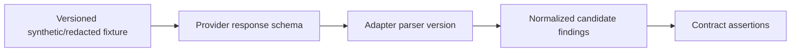

# Testing Strategy

**Status:** Active baseline. Vitest unit tests and an opt-in PostgreSQL integration lifecycle test are installed in Phase 1; provider, API authorization-matrix, security, accessibility automation, and E2E layers remain planned.

The current executable baseline covers encryption/authenticated context, no-plaintext key rewrap, lookup/challenge binding, normalization/masking, safe-log allowlisting, local-auth production rejection, closed provider source, concurrent idempotent onboarding, cross-account denial, atomic verification lockout, destructive-action reauthentication denial, deletion-provider failure/quarantine/retry, bounded retention eligibility, and complete foundation deletion. It uses synthetic `.test` addresses only.

## Test layers

| Layer             | Purpose                                       | Examples                                                               |
| ----------------- | --------------------------------------------- | ---------------------------------------------------------------------- |
| Unit              | pure normalization/policy/state behavior      | canonicalization, fingerprint vectors, state transitions, redaction    |
| Integration       | boundaries with disposable local dependencies | PostgreSQL transactions, leases, encryption/KMS fake, deletion cascade |
| Provider contract | adapter response compatibility                | fixture → schema validation → normalized candidates/provenance         |
| Database          | constraints, isolation, temporal queries      | tenant access, unique idempotency, observation ordering                |
| API               | authentication/authorization/input/output     | BOLA/IDOR, CSRF, generic enumeration, budget denial                    |
| Security/privacy  | misuse and leakage controls                   | SSRF vectors, XSS payloads, secret scan, PII log canaries              |
| End-to-end        | critical user outcome                         | add/verify identifier, synthetic scan, review, suppression, deletion   |

## Mandatory scenarios

- duplicate provider result across pages/retries creates one finding and multiple appropriate observations;
- provider outage produces partial scan and explicit coverage, not false absence;
- rate limit honors retry time without exceeding budget;
- “not me” creates scoped suppression and prevents resurfacing while remaining reversible;
- deleted user cannot authenticate and all deletion-manifest stores reconcile;
- encrypted identifier cannot be recovered from DB alone and rotation preserves authorized reads;
- provider timeout is bounded/cancelled and other runs continue;
- scan cancellation stops undispatched work and records unavoidable in-flight result safely;
- present → missing → present yields `REAPPEARED` without destroying history;
- malformed/huge/hostile provider content is rejected/quarantined, never rendered/logged;
- cross-tenant object IDs fail uniformly;
- cost reservation prevents fan-out/retry overspend.

## Provider contract testing

Each fixture declares provider ID/API version, capture/synthetic source, sanitization review, terms-compatible storage basis, expected normalized output, parser version, and expiry/review date. Prefer fully synthetic fixtures. If a real response is ever necessary, obtain contractual permission, irreversibly redact it, remove headers/tokens/PII, and review it before commit.

Contract assertions cover enum mapping, provenance completeness, stable external IDs, no prohibited fields, maximum sizes, pagination, empty response, partial data, 401/403, 404, 429 with `Retry-After`, 5xx, timeout, malformed fields, schema additions, malicious HTML/URLs, and currency/cost accounting.

Scheduled canary calls are not part of local tests and require explicit provider sandbox authorization, hard budget, synthetic identifiers, and a production-readiness decision.

## Privacy/security gates

- deterministic PII canary strings must not appear in logs, traces, metrics, snapshots, screenshots, job payloads, or thrown errors;
- property/fuzz tests for URL normalization, parser bounds, state machines, and fingerprints;
- authorization matrix tests for every endpoint and relationship;
- SSRF corpus covers encoded/private IPv4/IPv6, redirects, DNS rebinding model, credentials in URL, schemes and ports;
- CSP/XSS tests render hostile titles/snippets as inert text;
- deletion test covers DB, cache, object store, queue, auth, telemetry policy, processor calls, and backup tombstone;
- threat model and provider approval checklist are release gates.

## Environments and data

Unit tests use in-memory pure objects; integration uses disposable local PostgreSQL; E2E uses a clean synthetic tenant and mock adapters. Preview never imports production data or credentials. Tests are parallel-safe and leave no external state.

## Quality targets

Favor risk-based coverage over a percentage target. Require exhaustive state-transition tests and branch coverage for authorization, verification, encryption, deletion, dedupe, cost limits, and provider error classification. Accessibility tests combine automated rules with keyboard/screen-reader/manual review against WCAG 2.2 AA: [W3C WCAG overview](https://www.w3.org/WAI/standards-guidelines/wcag/).
